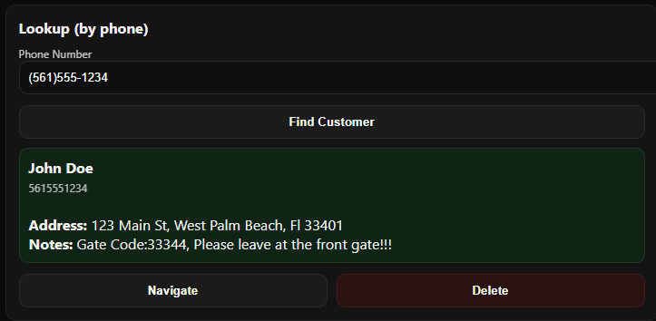
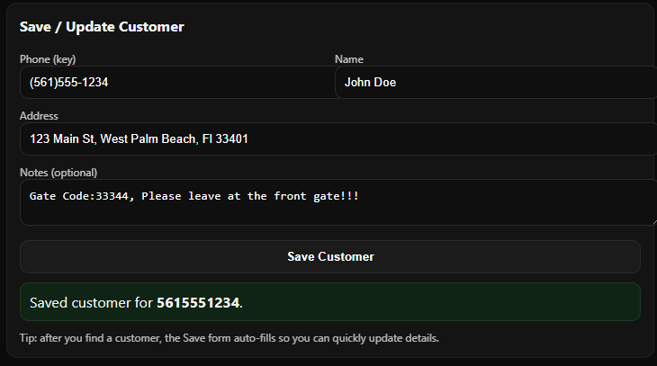
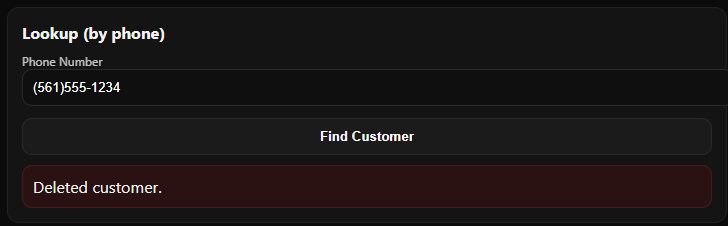
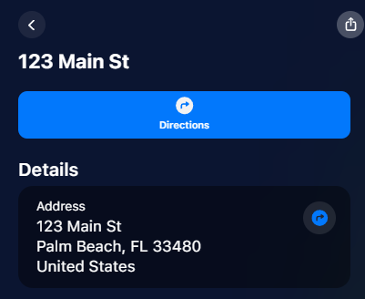

# Vinny’s Route Optimizer

---

## Overview

Vinny’s Route Optimizer is a **web-based route and customer management application**.  

It is designed for delivery drivers, service professionals, or anyone needing to **manage customers and visit multiple addresses efficiently**.  

**With this app, you can:**

- Look up customers by phone number  
- View their name, address, and notes  
- Edit or save customer information  
- Delete customer records  
- Open the customer’s address in **Apple Maps** for navigation  
- Works on **desktop and mobile**  
- Optional offline support via **service worker (PWA)**

---

## Demo
[](https://www.youtube.com/watch?v=VnmwqDk0mcs)

---

## Features

- **Customer Lookup:** Enter a phone number and retrieve stored customer info.  
- **Add / Edit Customers:** Save new customers or update existing info (name, address, notes).  
- **Delete Customers:** Remove outdated or incorrect records.  
- **Navigation Integration:** Click “Navigate” to open the address directly in Apple Maps.  
- **Mobile-Friendly:** Fully responsive interface for smartphones and tablets.  
- **Offline Support:** Service worker (`sw.js`) allows offline viewing once the app is loaded.

---

## File Structure

| File | Purpose |
|------|---------|
| `index.html` | Main HTML interface for viewing and editing customer data |
| `app.js` | Handles the app logic: lookup, save, delete, and navigation |
| `db.js` | Handles local storage / database of customer data |
| `manifest.json` | Web app manifest for PWA installability |
| `sw.js` | Service worker for offline functionality |
| `README.md` | Project documentation |
| `LICENSE` | MIT License |

---

## How to Use (Desktop)

### Step 1: Install Git (if you don’t have it)

**Windows:**  
Download Git from [https://git-scm.com/download/win](https://git-scm.com/download/win) and install with default options.

**Mac:**  
Open Terminal and type:

```bash
git --version
```
If Git isn’t installed, it will prompt you to install **Xcode Command Line Tools** → click “Install”.

---

### Step 2: Clone the Repository

Open Terminal (Mac) or Command Prompt / PowerShell (Windows) and navigate to the folder where you want the app:

```bash
cd path/to/your/folder
```

Clone the GitHub repository:

```bash
git clone https://github.com/szizzo522/vinnys-route-optimizer.git
```

Navigate into the project folder:

```bash
cd vinnys-route-optimizer
```

---

### Step 3: Run the App Locally

The app is a **web-based HTML/JS project**, so it doesn’t need installation, but **service workers (offline mode)** require a local server.

**Option 1: Python built-in server (Python 3 required)**

```bash
python -m http.server 8000
```

Open a browser and go to: `http://localhost:8000`  
The app will load, and service worker caching will work.

**Option 2: VSCode Live Server (Recommended for beginners)**

1. Install [Visual Studio Code](https://code.visualstudio.com/).  
2. Open your project folder in VSCode.  
3. Install the **Live Server** extension from the VSCode Marketplace.  
4. Right-click `index.html` → **Open with Live Server**.  
5. The app opens in your browser and fully supports PWA features.

---

### Step 4: Use the App

1. **Lookup Customers**  
   - Enter a customer’s phone number in the **lookup field** and click **Lookup**.  
   - Displays **name, phone, address, and notes**.  
   

2. **Edit or Save Customers**  
   - After lookup, fields are prefilled. Update the info and click **Save**.  
   - To add a new customer, fill in the fields and click **Save**.  
   

3. **Delete Customers**  
   - Click **Delete** to remove the customer from the database.
 

4. **Navigate to Address**  
   - Click **Navigate** to open the address in **Apple Maps**.  
   

---

## How to Use on Mobile

1. Open the app URL in your mobile browser (Chrome, Safari, Edge).  
2. **Add to Home Screen**:  
   - **iOS:** Share → Add to Home Screen  
   - **Android:** Menu → Add to Home Screen

3. Lookup, add, edit, or delete customers as on desktop.  
4. Use offline once the app has been opened online (cached by `sw.js`).

---


